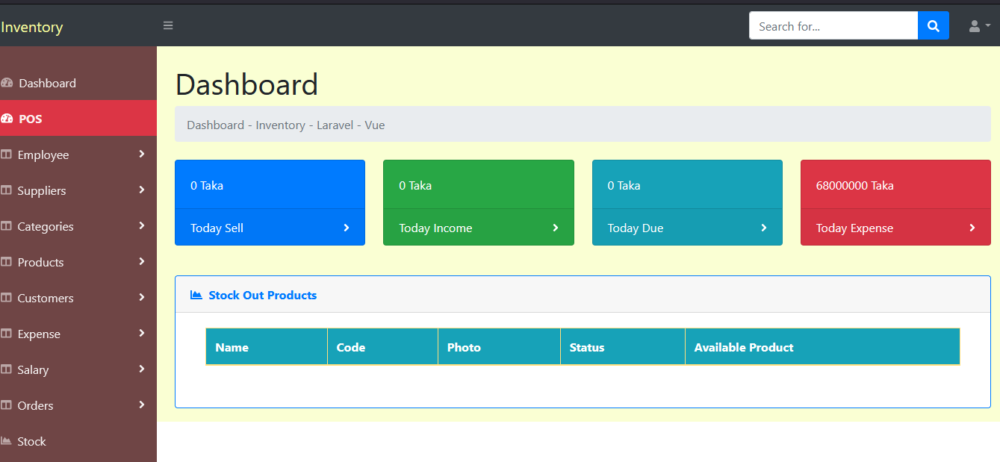
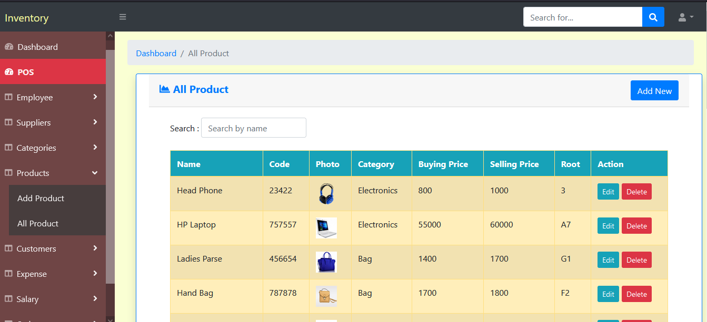
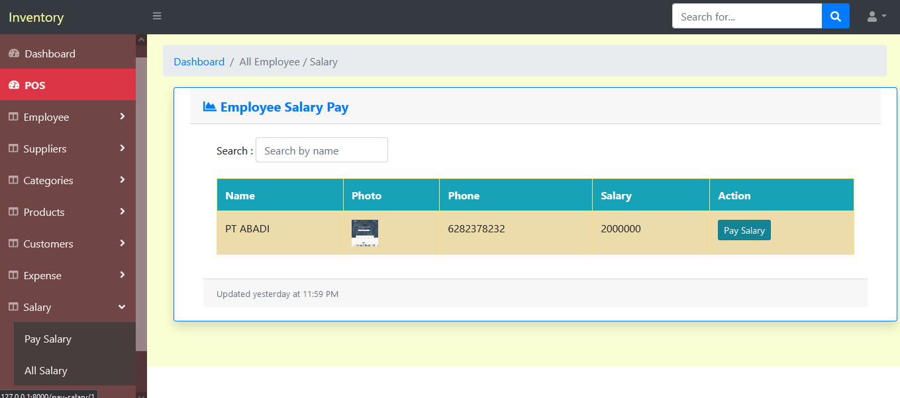

  
# Inventory(POS) using Vue + Laravel

## Database Schema
- Dashboard

--add product

--All Product

-- Salary

## Features

-   JWT Auth
-   RESTful API
-   Single Page Application(SPA)
-   POS
-   Category
-   Employee
-   Supplier
-   Products setup
-   Image upload
-   Customer
-   Salary
-   Expense
-   Cart
-   Order
-   Order details
-   Sell
-   Income
-   Due
-   Report
-   Errors validation
-   Stock management
-   Search
-   Settings

## Database Schema

-   Visit this -

-   Clone the repository
-   Run **_cd Inventory_**
-   Copy **.env.example** file to **.env** and edit **Database** credentials there
-   Run **_composer install_**
-   Run **_php artisan key:generate_**
-   Run **_php artisan migrate_**
-   Run **_npm install_**
-   Run **_php artisan serve_**
